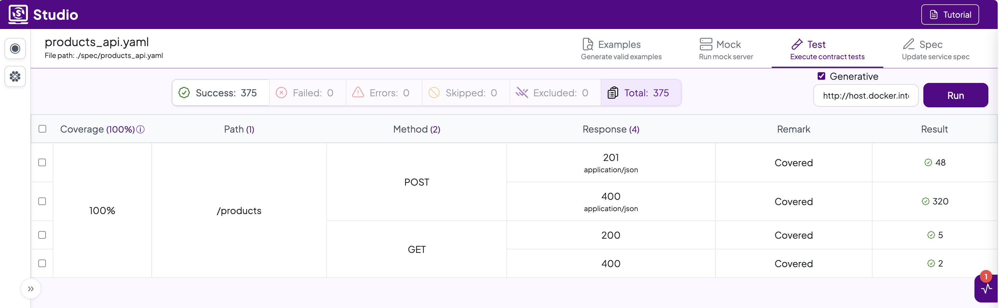

# Pre-Workshop Assignment

This assignment is designed to gauge your current understanding of the topics that will be covered in the upcoming Specmatic workshop. Please complete this assignment to the best of your ability. Your responses will help us tailor the workshop content to better suit your needs.

## Instructions
### 1️⃣ Clone this repository from GitHub to your local machine.
**DO NOT RAISE A PR AND SHARE YOUR SOLUTION WITH THE WORLD**

### 2️⃣ Setup Specmatic License
Specmatic Studio requires a license to operate. Your organization already has a Specmatic license. Please reach out to the workshop organiser to obtain the license file.
Replace the contents of this [license file](./.specmatic/specmatic-license.txt) with your license file.

### 3️⃣ Start Specmatic Studio using our Docker Image
From a terminal, run the following command:

#### macOS / Linux / PowerShell
```shell
docker run -it --rm \
    -p 9000:9000 \
    -p 9001:9001 \
    -v "$PWD/spec:/usr/src/app/spec" \
    -v "$PWD/.specmatic:/root/.specmatic" \
    -v "$PWD/build/reports/specmatic:/usr/src/app/build/reports/specmatic" \
    specmatic/specmatic-studio:latest
``` 
#### Windows Command Prompt
```shell
docker run -it --rm `
    -p 9000:9000 `
    -p 9001:9001 `
    -v "%cd%/spec:/usr/src/app/spec" `
    -v "%cd%/.specmatic:/root/.specmatic" `
    -v "%cd%/build/reports/specmatic:/usr/src/app/build/reports/specmatic" `
    specmatic/specmatic-studio:latest
```

### 4️⃣ Start Contract Testing your API

Open [Specmatic Studio](http://localhost:9000/_specmatic/studio) in your browser:

1. Open `products_api.yaml` file
   1. On the left side panel, you should see Available Specifications 
   2. Inside the `spec` folder, you should find the `products_api.yaml` file
   3. Click on the file to open the API specification.
2. By using the `products_api.yaml` OpenAPI spec file, you would need to implement an API which adheres to the spec.
3. Make sure to run the API locally on your machine before running the tests.
4. Navigate to the `Test` tab and enter the URL where your API is running (e.g., `http://host.docker.internal:8080`).
5. Click on the `Run` button to start contract testing your API. 
6. Run `Generative` Tests
   1. Once you've the basic, happy path tests passing, 
   2. select the checkbox for Generative tests and 
   3. click on the `Run` button again to run generative contract tests.
7. Your goal is to get all 375 tests to pass as shown in the screenshot below.


